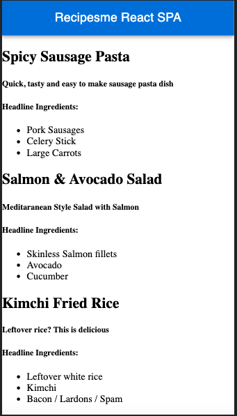
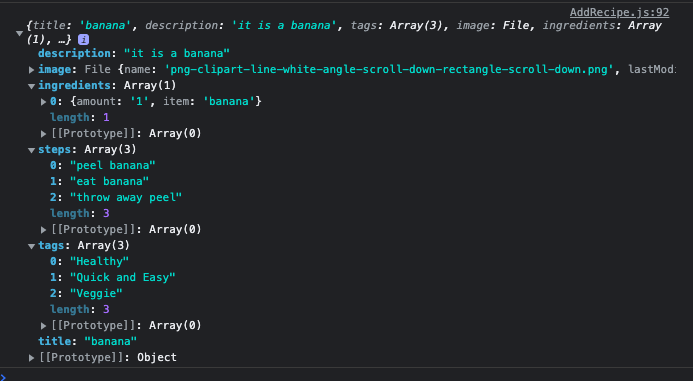
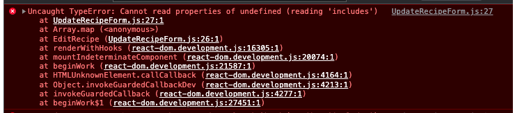

# Recipesme App     

## Build log:       

02/05/23:       

Basic setup on backend: local copy reverted to original, cloned version. Dependencies installed, `.env` file checked, test route checked ok, terminal reading ok.     

Frontend directory set up, `create-react-app` run, unneccessary default files/code deleted. **MaterialUI** installed and basic Header, Body and Footer components templated out. `body` margin set to `0px` in `index.css` to remove white border around app.       

Footer icons and positioning updated. Header updated and stripped back.     

**React Router** installed and implemented. Components added for Home, Index and Add. Navigation user footer tabs added: n.b. - if user manually navigates to a route, the tabs do not update accordingly at present.      

DB seeded with dummy data in prep for implementing index and detail components and functionality. Axios installed. First GET `/recipes` request working in FE - again I have had issues with the image url append functionality within the BE `recipeController.js`.      

Footer now fixed position: added vh-linked padding to bottom of `Body.js` to ensure data is not obscured by nav footer.     

Updated Recipe Index / Overview components: now displaying in flex-box with hidden div to ensure bottom row remains left-aligned.       

03/05/23:       

Now working on providing recipe detail. After some thinking (and advice getting) I have used a combination of `useNavigate()` and `useParams()` to pass recipe object id into an Axios request via the URL params.      

`RecipeDetail.js` component now successfuly recieving Axios requests. Next step is formatting details component(s).     

<p align="center">
    
</p>

04/05/23:       

`RecipeIngredients.js` component added - props being passed from parent (RecipeDetail) by mapping over `res.data.ingredients` and storing this in a state to be passed as a prop. Similar approach used for `RecipeSteps.js`.

I found that props were often initially being passed as undefined, and when a `.map()` was called in these two child components I was predictably getting an error. I understand that an alternative approach might be to check if props are or are not undefined and then either render a loading spinner or map out elements from the prop. I am not at this stage sure which is the better approach, although I like how using multiple states in the parent groups similar actions together and makes the child components less cluttered.      

`uuid` installed and impemented in RecipeSteps and RecipeIngredients in order to generate unique keys for each element created by `.map()`s.        

Found an issue where the 'Recipes' navigation button in the footer would not return the user to the recipe index. Issue solved by changing the functionality (and indeed appearance) of this central button when the user is in recipe detail view. This was achieved through the use of a state in `App.js`, which conditionally changes how the footer renders. A function prop is then passed down to the `Footer.js` and `RecipeCard.js` components which updates the state accordingly. Seems to be working nicely!

05/05/23:       

Started building `AddRecipe.js` - needed a quick refresher on React forms. I've decided to go with a a single state in which the form input is saved, and I am using a changeHandler function which runs `onChange` within each input box, and uses `e.target.value` and `e.target.name` to update the `formInput` state as appropriate. Tested working ok using only simple string input fields.       

Next step is to add a submit handler function. At preset it simply logs the submitted form: once I have added input types I will test the `Axios.post()` request. Form validation function added in order to prevent empty fields from being sumbitted.     

Description changed from `<input>` to `<textarea>`, tags input changed from text to checkboxes. `formChangeHandler` updated to account for new checkbox input type. I'm undecided as to whether this is the best approach, or if it would be better to split this out into two separate functions.     

Image upload added, file is being attached successfully to the formInput object, using an `imageUploadHandler` function. During previous attempts at similar image upload functionality I was not making use of `target.files[]` and instead updating form data states with a file path.        

My next step is to allow for multiple ingredients / steps to be added to a recipe. My intial thoughts are to move these input out into child components.        

After some experimentation, I've got to the point where the two child components (`AddIngredient.js`, `AddStep.js`) update the `formInput` state in their parent `AddRecipe` component. The next step is to render the newly added ingredient/step array elements within the form and re-render a new, empty form field so that multiple steps/ingredients can be added.        

Tackling the simpler 'step' array first, I found that even though the `step` array in the `formInput` state was updating ok, the `AddRecipe` component was not updating so the added steps were not rendering at first. Using spread syntax when cloning the state (`const newFormInput = {...formInput}`) resolved this.       

Solved an issue where the `AppBody` component was not growing as its child element `AddRecipe` increased in size (the bottom of the form was not scrollable and therefore became in effect hidden) - used `display: table;` on `.app-body` in `Main.css`.       

`AddStep` input box was not clearing after submission: element was re-rendering with the previous value. I initally approached this through clearing the `step` state: however this meant that even though a second submission read as empty, the previous text value remained visible. Using `target` within `addButtonPress()` would of course not work (target being the `+` button); I therefore used `document.getElement [...].value = ''` to clear the text input after submit - this worked nicely!     

The `AddStep` input box does not currently submit on enter - I feel users would naturally choose this over the `+` button. Adding an `eventListener()` to `inputElement` sometimes causes errors (`Cannot read properties of null ()`) - instead I went for another function `submitOnEnterPress()` which is called `onKeyDown` and reuses `addButtonPress()` if `e.key === 'Enter'`. I'm pretty pleased with this solution as it feels quite neat and simple!      

07/05/23:       

Added steps now render within a component `Step.js` inside `AddStep`. A `-` button allows for previously added steps to be removed as well.     

Next, I am rolling out the same functionality to ingredients. Some code is just 'copy-paste' from `Step` / `AddStep`, however the fact that each ingredients array item is an object rather than a string brings some additional nuance. I've decided to split out `removeFieldHandler()` into `removeStepHandler()` and `removeIngredientHandler()` due to their differing approach to filtering arrays of strings and objects respectively. I have also used `.select()` in order to move the cursor from the `ingredient` input box on the right to the `quantity` input box on the left of `AddIngredient` as this makes for more user-friendly form completion.

I had previously been checking for empty ingredient/step inputs within `addFieldHandler()`, however the check that works for steps as strings does not work for ingredients as objects. I have instead decided to move this check out from `AddRecipe` to its child components `AddStep` and `AddIngredient` respectively.      

In implementing the above, I noticed a bug whereby pressing enter on an empty `amount-input` field also triggered an `onClick` event in the 'remove ingredient' button for the most recently logged ingredient. I was not able to trace back the cause of the issue, however by adding `onKeyDown={e => submitOnEnterPress(e)}` to the `amount-input` field rectified this issue.       

As I was about to move onto Axios testing for the `AddRecipe` form, I noticed that my (previously working) checkboxes no longer worked. I initially traced this issue back to the use of spread syntax (`const newFormInput = {...formInput}` - added after checkbox functionality was tested), however when I changed back to my initial approach of directly assigning the `formInput` state to the `newFormInput` variable, the checkboxes seemingly worked but would not save their `checked` prop upon further interaction with the form.      

Firstly, I finally made the call to separate out checkbox inputs from text inputs. I then implemented an `isChecked` state, intialised as an array of `false` booleans the length of the `tags` array. As checkboxes are checked and unchecked, `formInput.tags` is updated as before, but now the new `isChecked` array is also updated: the `checked` prop of each checkbox is set based on its respective index within the boolean `isChecked` array, thus storing checked statuses safely in state.     

First Axios post tests for adding recipes returned `500` errors relating to Mongoose Model validation errors: the problem lay with the ongoing issue I have had with getting image uploads to work on the backend (currently lacking correct AWS/Cloudfront keys in the `.env` file). With the validations around `image` and `imageURL` properties temporarily removed I was able to successfully post new recipe documents to the DB.     

<p align="center">
    
</p>

Successful POST requests result in the user being navigated to the Recipe Index.        

11/05/23:       

Moving on to UPDATE functionality - this will be accessed through the Recipe Detail components. Buttons added to `RecipeDetail.js`.         

Naturally, I'm going to use the components in `/add_recipe` as a jumping off point. My inital thought is to copy and then adapt the `AddRecipe` component - and then directly reuse the Step/Add Step + Ingredient/Add Ingredient components within `UpdateRecipe.js`. Let's see if it will work!       

Routing set up from `Body` component - the `/update/` route will use an `:id` param to get the recipe data and pre-load the form. This should work, although I wonder whether this is the most efficient way given the recipe data is already populated within `RecipeDetail` is there a better way of passing on this data that does not require another GET?     

I've decided to implement the above - avoiding a second GET request - instead of using a `recipe` state in `RecipeDetail` I instead store the state within its parent component `Body` and pass this down as a prop to both `RecipeDetail` and `UpdateRecipe`, granting access to both with a single Axios request.     

At present, the `recipe` prop is loading `steps` and `ingredients` ok within `UpdateRecipe`, however I am having less success getting other fields to render with previous values as default...     

...and the solution was a simple one: `defaultValue` (rather than, for some reason, `value` as I was using before!). Brain not working so well today!    

I've decided to use the state `fieldsToUpdate` within `UpdateRecipe.js` to provide the `req.body` from which the backend updates the document. As per the API README: _"Only fields wanting updating are necessary"_ - this state only stores fields that have been updated, reducing unneccessary (that is to say, unchanged) data from being passed in the request.       

Tags now load as checked or unchecked based on existing recipe tags, and when changes are made, the `fieldsToUpdate` prop updates accordingly too.      

I've also made the call to extract 'change image' functionality from `UpdateRecipe` and instead perform this from within `RecipeDetail` as a standalone action, for now.        

12/05/23:       

Some adjustments required to get Steps and Ingredients to work correctly in `UpdateRecipe`. For addition or removal of items from the `steps` or `ingredients` arrays, in the first instance per form load the respective array from `recipe` needs assigning to `newFieldsToUpdate`, otherwise `push()` or `filter()` are being called on `undefined`.

Furthermore, when removing items, the `Step` / `Ingredient` components need to be mapped from `fieldsToUpdate` rather than `recipe` as on initial render.       

I've done some restructuring and renaming - given the closeness between Add Recipe and Update Recipe, and the reuse of child components shared by both, I figured it would make more sense for these to be in the same directory with a subdirectory for the shared components.

13/05/23:       

`Axios` request added to `UpdateRecipeForm` - returning `status: 200` and `req.body` is logging in BE as expected (`fieldsToUpdate`) however documents are not updating at present...?      

I'll revisit the above later. Moving on to DELETE functionality now. Was reasonably easy to implement!      

- _fixed the above issue where document not being updated with three keystrokes... needed `...` in front of `fieldsToUpdate`: without spread syntax the body object had the object name and its properties as a key:value pair rather than the key:values from within the `fieldsToUpdate` object..._     

14/05/23:       

`UpdateRecipeForm` now navigates to `RecipeDetail` upon successful form submission.     

I have realised that the `Ingredients` property in `recipeSchema` in the backend in fact can have an object of three keys, which are cast to specific types:      

```
        {
            item: String,
            amount: Number,
            unit: String
        }
```

All three fields are optional, however at present I am only using `amount` and `item`, and the requirement for `amount` to be `Number` means values like `pinch` cannot be entered. I'm therefore going back over `form_components` to make the required updates.       

It seems sensible to make `ingredient.item` compulsory during CREATE/UPDATE recipe but the other two properties optional, so I have updated the `if` statement within `AddIngredient`'s `addButtonPress()` to reflect this.     

As the `Ingredient` and `AddIngredient` components are shared between Add Recipe and Update Recipe forms only one update is required for both, which was nice.      

`ingredient.unit` also added to `RecipeIngredients` within `recipe_detail/`.        

`AddRecipeForm` updated so that an image is no longer required for submit.      

22/05/23:       

Footer icons now update (correct icon highlighted, either 'RECIPES' or 'BACK' shown as middle icon depending on if user is in index or detail view) even when user manually navigates to a path.        

Getting the path from the URL was simple enough, as was using `setValue()` to highlight the correct icon. Causing either "BACK" or "RECIPES" to display correctly was trickier, as normal 'click'-based navigation relies on a the `detailView` prop to render conditionally.       

Rather than passing the newly-added functionality up to a parent component, or indeed making the mistake of trying to directly change the `detailView` prop within `Footer.js`, I decided to incorporate an 'OR' operator within the JSX ternary statement condition which would evaluate both the `detailView` prop and a new `detailViewOverridden` state: if either evaluate to `true` the user is in 'detail' view and the "BACK" button should be rendered in the footer.      

I'm now working on providing user feedback upon action completion. I have used _MUI_ 'toast' notifications in the past so I felt this was a good place to start. I've decided to use 'snackbar' notifications for actions such as add recipe success, delete recipe success, etc.     

The first thing that has become apparent is that there is an added degree of complexity when working with notifications as part of a React SPA, as compared with using toast notifications with multi-page apps (a Django app, if I remember correctly) as I have done in the past. The first decisions to be made relate to where to place my notification components in terms of the parent-child hierarchy, and then how to go on to split different notification components up.     

I have decided to go with a `Notifier` component as a child of `App.js`. Each type of message will be a child component of `Notifier.js`. The 'show' functionality for notifications will sit in `App` and can then be passed down via `Body` to descendants as required.       

With this setup I have been able to get a simple 'success' notification (`Success.js`, shockingly) to display when a recipe is successfully added. The next challenge will be working out how best to render different notifications through the current setup.     

23/05/23:       

By passing a object instance of a `Notification` class (imported from `snackbarHelper.js`) into `showSnackbar()`, and making changes to `Notifier`, I am now able to reuse notifications and the `showSnackbar` function across the app. The object passed in takes a `type` property which defines the appearance of the snackbar notification, and a `message` property that provides the notificaiton content.       

I've refactored the user feedback components significantly - now using just two: a `Notifier` and a `Notification` (rather than distinct components for each notification type as before). I have also renamed a lot of variables and directories for clarity - now referring to 'notification(s)' and 'user feedback' rather than the more obscurely named 'snackbar'... which would make no sense to anyone unfamiliar with the MUI component referenced.       

I'm now rolling out user feedback across the app. I'm pretty happy with the structure in place: I am able to easily update components to show notifications with relatively few edits, and the method by which notificaitons are produced is consistent regardless of use case.     

Fixed issue where scroll position persists through `react-router-dom` navigation (meaning user is often placed half-way down or at the bottom of a new page when navigating). Simply a case of finding the right _Stack Overflow_ thread and copy-pasting the best solution!        

Removed inline styles used in `AddRecipeForm`, `UpdateRecipeForm` and `RecipeDetail` in order to prevent micro re-renders.      

24/05/23:       

Fixed bug where footer highlight still not updating properly on manual browser bar navigation (getting stuck on "BACK" and not reverting to "RECIPES").     

Fixed another bug where refresh / manual navigation to an Update Recipe form breaks app: `recipe` prop passed is empty object (no `Axios.get` request is made) - this causes `includes()` and `map()` methods to error where no property (and therfore no array) is found when called.      

<p align="center">
    
</p>

Was a tricky one to get working - _and potentially indicative of a problematic approach?_ - but it seems to all work ok now!         

User feedback rolled out across app, with notifications added to `RecipeDetail` to cover DELETE user actions. At this point I believe all necessary notifications have been implemented.        

## To add / to-do:      
- MUI theming: need to look at the documentation in more detail and/or find a decent tutorial for this.     
- Recipe steps cannot yet be reordered or edited during `AddRecipe` and `UpdateRecipe` form completion.       
- `AddRecipe` and `UpdateRecipe` could be condensed into a single form component - at present there is a lot of duplication.        
- Placeholder image to be added if no image uploaded during CREATE recipe.       
- No FE validation on Update Recipe to prevent form with empty fields from being submitted.     
- Implement loading spinner within `UpdateRecipeForm`.      
